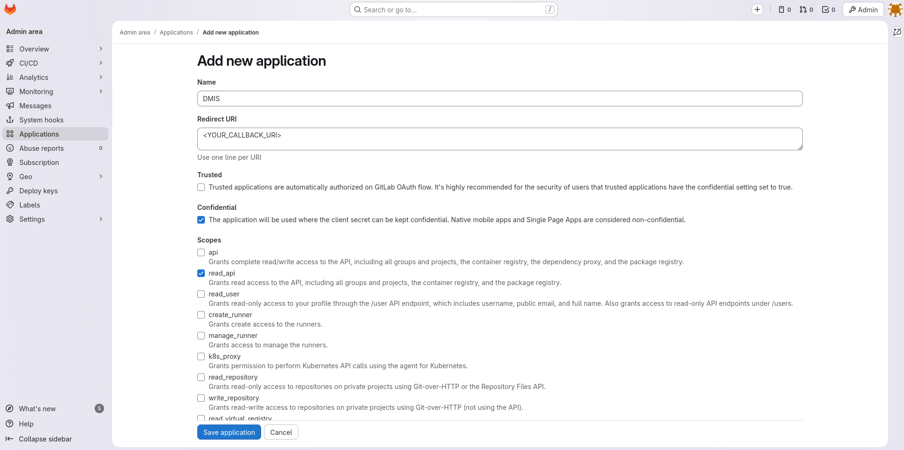

# Setup instuctions

## System

1. Bulid all the images and pull down the latest base tag.
```
docker compose build --pull
```
2. In the docker-compose.yaml file, set all environment variables.
3. Run the stack.
```
docker compose up
```

## Configure application in source systems

To set up functioning session authentication for base systems, the following setup is required

### Gitlab

  1. Log in to an account with administrative privelages
  2. In the top right corner, click on 'Admin'
  3. Click on 'Applications' in the left column
  4. Create a new application according to the picture below


