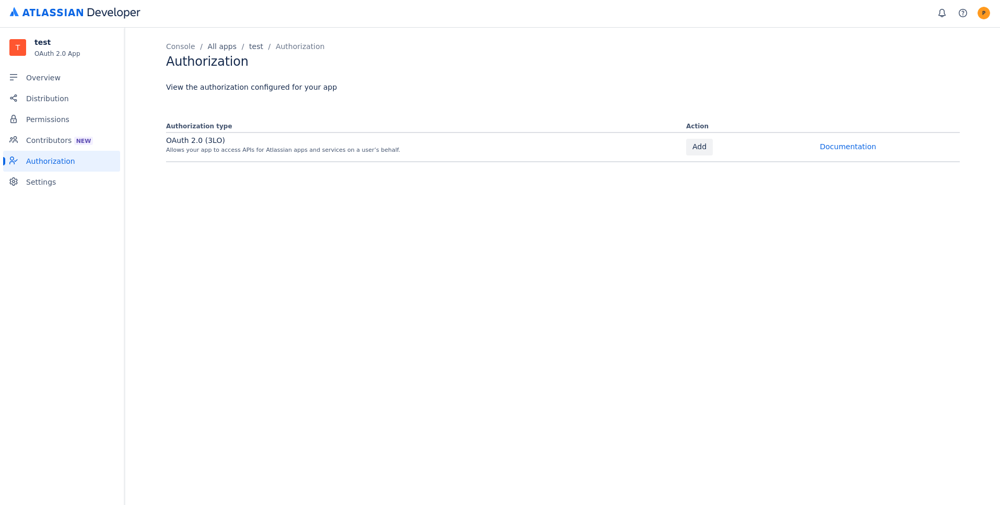

# Setup instuctions

## System

Note: Instructions on which environement variables can be found in each microservices respective README.

1. Bulid all the images and pull down the latest base tag.
```
docker compose build --pull
```
2. In the docker-compose.yaml file, set all environment variables.
3. Set up a source_systems.json config file according to [this](https://github.com/Studentprojekt-KCL/document_management_system/blob/develop/src/connectors/connector-gateway/README.md#build-and-run-container).
4. Run the stack.
```
docker compose up
```

## Configure application in source systems

To set up functioning session authentication for base systems, the following setup is required

### GitLab

  1. Log in to an account with administrative privileges
  2. In the top right corner, click on 'Admin'
  3. Click on 'Applications' in the left column
  4. Create a new application according to the picture below


### Confluence

  1. Go to https://developer.atlassian.com/console/myapps/
  2. Click on 'Create' and then 'Oauth 2.0 integration'
  3. Click on 'Authorization' in the left column, and under 'Action' click on Add (as seen in the picture below)
  4. Configure your callback URL/s, and press save.



### GitHub

The system connects to GitHub using a **GitHub App** with the OAuth user-to-server flow. The app grants the system read access to repository metadata and file contents on behalf of each authenticated user.

#### Create or configure the GitHub App

  1. Log in to GitHub with an account that has admin access to the target organization.
  2. Go to **Settings → Developer settings → GitHub Apps**.
  3. Click **New GitHub App** (or open an existing app to reconfigure it).
  4. Fill in the required fields:
     - **GitHub App name**: e.g. `DMS Lookup`
     - **Homepage URL**: the public URL of your deployment
     - **Callback URL**: the public URL of the GitHub connector's `/callback` endpoint
       (this must match `CONGITHUB_CONNECT_SERVICE_CALLBACK` in the environment configuration)
  5. Under **Webhook**, uncheck **Active** unless you intend to use webhooks — the connector does not require them.
  6. Under **Repository permissions**, set the following:
     - **Metadata**: Read-only
     - **Contents**: Read-only
  7. Under **Where can this GitHub App be installed?**, select **Only on this account** (recommended) or **Any account** depending on your deployment.
  8. Click **Create GitHub App**.

#### Retrieve credentials

  1. On the app's settings page, copy the **Client ID** - this is `CONGITHUB_CLIENT_ID`.
  2. Scroll to **Client secrets** and click **Generate a new client secret** - this is `CONGITHUB_CLIENT_SECRET`. Store it securely; GitHub will only show it once.

#### Install the app on the target organization

This step is performed **once by an administrator**. It grants the app access to the organization's repositories and defines the ceiling of what can ever be indexed - individual user permissions are enforced on top of this at query time via the OAuth flow.

  1. In the left sidebar of the app settings, click **Install App**.
  2. Select the organization or account that owns the repositories to be indexed.
  3. Choose **All repositories** or select specific repositories to further restrict access.

#### Set environment variables

Set the following environment variables for the GitHub connector service:

| Variable | Value |
|---|---|
| `CONGITHUB_CLIENT_ID` | Client ID from the app settings page |
| `CONGITHUB_CLIENT_SECRET` | Client secret generated above |
| `CONGITHUB_CONNECT_SERVICE_CALLBACK` | Public URL of the connector's `/callback` endpoint |
| `CONGITHUB_STATE_SIGNING_SECRET` | A random secret used to sign CSRF state tokens (generate with e.g. `openssl rand -hex 32`) |
| `CONGITHUB_GITHUB_API_URL` | `https://api.github.com` (or `https://<host>/api/v3/` for GitHub Enterprise) |
| `CONGITHUB_GITHUB_BASE_URL` | `https://github.com` (or `https://<host>` for GitHub Enterprise) |
| `CONGITHUB_GITHUB_ORG` | *(Optional)* The organization login slug to restrict indexing to that org's repositories |

### SharePoint

The system connects to SharePoint using an **Azure AD application registration** with OAuth 2.0 delegated permissions. Each user authenticates individually; the connector reads only what the user can access.

#### Register an application in Azure AD

  1. Log in to the [Azure portal](https://portal.azure.com) with an account that has permission to register applications.
  2. Go to **Entra ID → App registrations** and click **New registration**.
  3. Fill in the required fields:
     - **Name**: e.g. `DMS Lookup`
     - **Supported account types**: choose the option that matches your tenant (typically *Accounts in this organizational directory only*)
     - **Redirect URI**: set the platform to **Web** and enter the public URL of the SharePoint connector's `/callback` endpoint. This must match `CONSHAREPOINT_CONNECT_SERVICE_CALLBACK`.
  4. Click **Register**.

#### Grant API permissions

  1. In the app's left sidebar, click **API permissions → Add a permission → Microsoft Graph → Delegated permissions**.
  2. Add the following permissions:
     - `Sites.Read.All`
     - `Files.Read.All`
     - `offline_access`
  3. Click **Grant admin consent** for your organization. `Sites.Read.All` requires admin consent in enterprise and education tenants.

#### Retrieve credentials

  1. On the app's **Overview** page, copy the **Application (client) ID** - this is `CONSHAREPOINT_CLIENT_ID`.
  2. Copy the **Directory (tenant) ID** from the same page - this is `CONSHAREPOINT_TENANT_ID`.
  3. Go to **Certificates & secrets → New client secret**, set an expiry, and click **Add**. Copy the generated value immediately - this is `CONSHAREPOINT_CLIENT_SECRET`. Azure will not show it again.

#### Set environment variables

Set the following environment variables for the SharePoint connector service:

| Variable | Value |
|---|---|
| `CONSHAREPOINT_TENANT_ID` | Directory (tenant) ID from the app overview page |
| `CONSHAREPOINT_CLIENT_ID` | Application (client) ID from the app overview page |
| `CONSHAREPOINT_CLIENT_SECRET` | Client secret generated above |
| `CONSHAREPOINT_CONNECT_SERVICE_CALLBACK` | Public URL of the connector's `/callback` endpoint |
| `CONSHAREPOINT_STATE_SIGNING_SECRET` | A random secret used to sign CSRF state tokens (generate with e.g. `openssl rand -hex 32`) |
| `CONSHAREPOINT_GRAPH_BASE` | `https://graph.microsoft.com/v1.0` |
