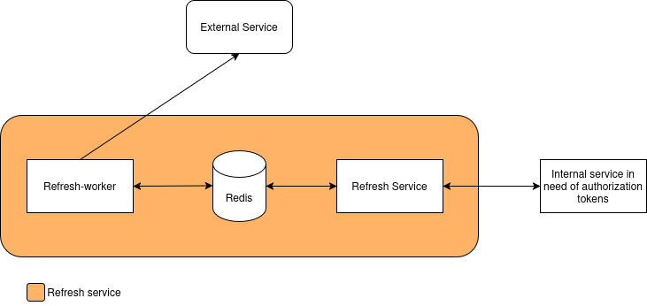

# Refresh service

The refresh service serves the purpose of storing credentials used for authentication against external systems, and periodically refreshing said credentials in the case they are of type session token. The refresh service requires three componants running in induvidual containers, as seen below:




## Refresh service contianer

### Environment Variables

- **REFSERVICE_BIND_ADDR**: Which address to bind to.
- **REFSERVICE_BIND_PORT**: Which port to bind to.
- **REFSERVICE_SESSION_ENC_PASSW**: Encryption password for session tokens at rest.
- **REFSERVICE_REDIS_HOST**: Redis DB host.
- **REFSERVICE_REDIS_PORT**: Redis DB port.
- **REFSERVICE_AD_URL**: Domain of AD issuer.
- **REFSERVICE_AD_JWKS_URL**: Openid connect url URL to AD, usually ending in /openid-connect/certs ('sub' is used for session token storage).

### Behaviour

The service can recieve authorization tokens for new services, an encrypted representation will be stored in the DB, indexed based on the user authorization 'sub'.

### Endpoints

|Endpoint|Method|Description|
|--------|------|-----------|
|`/add_session_token`|POST|Add session token for new service.|
|`/get_session_tokens`|POST|Retrieve session token for given services.|


#### add_session_token

*Headers*

- **authorization**: Bearer token for user in DMIS service.

*Params*

- **service_name**: Name for service which new authorization is connected to.

*Body*

```json
{
    "refresh_url": "<POINTER TO PLACE TO REFRESH (usually in connector layer)>",
    "session_variables": "<Actuall authorization token>"
}
```

#### get_session_tokens

*Headers*

- **authorization**: Bearer token for user in DMIS service.

*Body*

```json
["<service_name>", "<service_name>"]
```

## Refresh worker container

### Environment Variables

- **REFSERVICE_SESSION_ENC_PASSW**: Encryption password for session tokens at rest.
- **REFSERVICE_REDIS_HOST**: Redis DB host.
- **REFSERVICE_REDIS_PORT**: Redis DB port.

### Behaviour

The service will sit in the background and refresh session tokens when instructed to do so by redis. Point of refresh is specified in the body when calling the *add_session_token* endpoint in the refresh-service API.